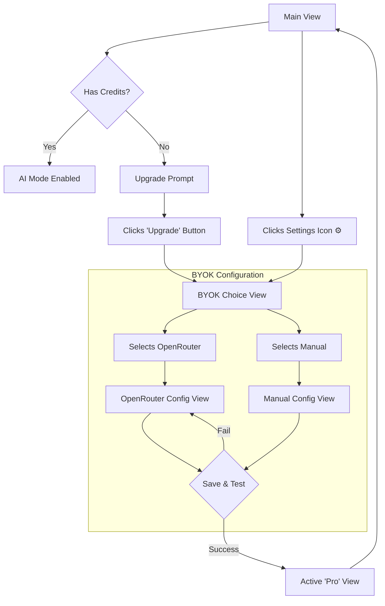

### **Document: `docs/front-end-spec.md` (Complete & Final)**

```markdown
# PromptReady UI/UX Specification v1.1

*   **Status:** FINAL - Approved for Development
*   **Author:** Sally (UX)

## 1. Introduction

This document defines the user experience goals, information architecture, user flows, and visual design specifications for PromptReady's user interface. It serves as the foundation for visual design and frontend development, ensuring a cohesive and user-centered experience.

### 1.1. Overall UX Goals & Principles

#### Target User Personas
*   **The Developer:** Needs efficient, precise capture of code and technical documentation.
*   **The Researcher / Student:** Needs clean text with reliable citations for academic work.
*   **The Content Creator:** Needs a fast way to strip boilerplate for content repurposing.

#### Usability Goals
*   **Zero to Magic in 30 Seconds:** First-time users must get value within 30 seconds.
*   **One-Click Workflow:** The core loop should feel like a single, instantaneous action.
*   **Effortless Clarity:** Users must instantly understand the UI, credit system, and the flexible upgrade paths.

#### Design Principles
1.  **Simplicity Above All:** If it adds complexity to the primary view, it will be removed or progressively disclosed.
2.  **Instantaneous Feedback:** Every action must have an immediate visual response.
3.  **Progressive Disclosure:** Show only what is needed, when it is needed. The powerful BYOK options are hidden until explicitly requested.
4.  **Clarity & Transparency:** Be brutally honest about how the freemium model and BYOK security works.

### 1.2. Change Log
| Date | Version | Description | Author |
| :--- | :--- | :--- | :--- |
| August 20, 2025 | 1.1 | Re-imagined BYOK flow to support multi-provider and direct setup. Added new components. | Sally (UX) |
| August 20, 2025 | 1.0 | Initial draft of the UI/UX Specification. | Sally (UX) |

## 2. Information Architecture (IA)

#### Screen Inventory / State Map
The entire user experience is contained within the main popup. Here is a map of its primary states, including the new BYOK configuration path.



#### Navigation Structure
*   **Primary:** "Offline / AI" toggle.
*   **Secondary:** A subtle "Settings" (gear icon) provides a direct path to the BYOK configuration.
*   **Tertiary:** Contextual prompts (e.g., "Upgrade with your API Key") provide an alternative path to the BYOK configuration.

## 3. User Flows

#### Flow 1: First Use & Core Cleanup (Unchanged)
*   **Goal:** Clean and copy web content for the first time.
*   **Entry:** User clicks extension icon.
*   **Success:** Clean Markdown on clipboard in <10 seconds.
*   **Key Detail:** The popup closes automatically on success.

#### Flow 2: Proactive BYOK Setup (New)
*   **Goal:** A power user wants to use their own key immediately, without waiting for the free trial to end.
*   **Entry:** User, at any time, clicks the subtle "Settings" (gear icon) in the popup.
*   **Flow:**
    1.  The UI transitions to the **BYOK Choice View** ("Connect your AI Provider").
    2.  The user selects either "OpenRouter" or "Manual".
    3.  The UI updates to the corresponding **Configuration View**.
    4.  The user enters their details and clicks "Save & Test".
    5.  Upon successful validation, the UI transitions to the **Active 'Pro' View**.

#### Flow 3: Upgrade to BYOK (Re-imagined)
*   **Goal:** Restore AI Mode after credits are depleted, with maximum flexibility.
*   **Entry:** User with 0 credits tries to use AI Mode.
*   **Flow:**
    1.  The UI shows the **Upgrade Prompt** ("You're out of credits.").
    2.  User clicks the "Upgrade" button, which takes them to the **BYOK Choice View**.
    3.  **Path A (OpenRouter):**
        *   User selects "OpenRouter".
        *   User pastes their key into the input. Clicks "Save & Test".
        *   On success, a background API call fetches the models their key has access to.
        *   The **searchable `Combobox` for "Model" is populated dynamically.**
        *   The user selects a model and saves. The UI updates to the "Pro" state.
    4.  **Path B (Manual):**
        *   User selects "Manual".
        *   User fills in the `API Base URL`, `API Key`, and `Model Name`.
        *   User clicks "Save & Test".
        *   On success, the UI updates to the "Pro" state.
*   **Destructive Action:** If a user clicks the "Remove" button on a saved key, an `AlertDialog` appears to confirm the action, preventing accidental deletion.

## 4. Wireframes & Mockups

*   **Design Tool:** This document is the primary design spec.
*   **Key Screen States:**
    *   **Main View:** As previously defined (Toggle, Status, Button).
    *   **BYOK Choice View:** A clean view with two large, clear buttons: "OpenRouter" and "Manual".
    *   **BYOK Configuration View:** A settings-like view that dynamically shows the correct inputs based on the user's choice (OpenRouter vs. Manual).
    *   **Active 'Pro' View:** The main view, but with the status text updated to "Using your API Key" and the saved configuration accessible via the gear icon.

## 5. Component Library / Design System

*   **Approach:** We will use our existing **Tailwind CSS** and **Shadcn/UI** installation.
*   **Core Components:**
    1.  **Mode Toggle:** `Toggle Group`
    2.  **Primary Button:** `Button`
    3.  **Status Notifier:** `Toast`
    4.  **Input Field:** `Input` (with visibility toggle)
    5.  **Model Selector (New):** `Combobox` (a searchable dropdown for OpenRouter models).
    6.  **Confirmation Dialog (New):** `AlertDialog` (for confirming the "Remove Key" action).

## 6. Branding & Style Guide

*   **Visual Identity:** Clean, modern, efficient, and professional.
*   **Color Palette:** A primary blue, destructive red, success green, and neutral `slate` grays.
*   **Typography:** A modern, sans-serif system font stack (`font-sans`).
*   **Iconography:** `lucide-react` library, used sparingly.

## 7. Accessibility Requirements

*   **Standard:** Target **WCAG 2.1 Level AA** compliance.
*   **Key Requirements:** Ensure high color contrast, visible keyboard focus indicators, full keyboard navigability, and proper ARIA attributes.

## 8. Responsiveness, Animation & Performance

*   **Responsiveness:** Layout will be robust within the fixed-size popup container.
*   **Animation:** All animations will be subtle, fast, and meaningful (e.g., slide-in toasts, scale-down on button press).
*   **Performance:** Popup must load in **< 200ms** and all UI interactions must respond in **< 100ms**.

## 9. Next Steps

*   **Action:** Handoff this finalized specification to the development team.
*   **Checklist:** All key flows, including the new advanced BYOK path, are documented and complete.

```
