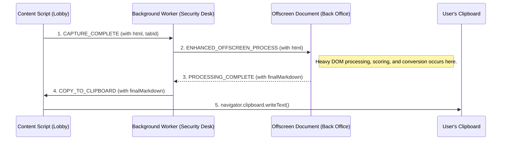

### **Document: `PromptReady Offline Processing Pipeline - Architecture & Evolution v2.0`**

*   **Status:** FINAL
*   **Last Updated:** August 16, 2025
*   **Purpose:** To provide a single, definitive source of truth for the architecture, design principles, and evolutionary history of the PromptReady offline content processing pipeline. This document is intended for onboarding new developers and for future architectural reviews.

### **1. Executive Summary**

The PromptReady offline processing pipeline is a sophisticated, hybrid engine designed to intelligently extract the main content from a webpage and convert it into clean, semantically structured Markdown suitable for both human readers and Large Language Models (LLMs). It evolved from a simple cleaner into a multi-stage, heuristic-driven system that robustly handles the complexities of the modern web.

Its core philosophy is to **use the best tool for the job**: it combines professional-grade sanitization, a custom two-stage boilerplate filter, a data-driven scoring engine with nested-content pruning, and an intelligent Markdown converter with semantic preservation for tables. This allows it to produce superior output on a wide variety of pages, from simple articles to complex technical datasheets.

### **2. Final Hybrid Pipeline Architecture**

The final architecture is a multi-stage pipeline that intelligently routes content through one of two paths. The "Intelligent Bypass Pipeline" is significantly more advanced, featuring multiple cleaning and refinement steps to handle complex, non-standard content.

```mermaid
graph TD
    A[Raw Captured HTML] --> B[1. Sanitize with DOMPurify];
    B --> C[2. Apply Safe Boilerplate Filter (UNWRAP)];
    C --> D{3. Decision Point: Is this a technical page?};
    D -- No (Blog Post, etc.) --> E[Standard Pipeline];
    D -- Yes (skf.com, etc.) --> F[Intelligent Bypass Pipeline];

    subgraph Standard Pipeline
        E --> G[4a. Extract Main Content with Readability.js];
    end

    subgraph "Intelligent Bypass Pipeline (Multi-Stage)"
        F --> H[4b. Aggressive Filter (REMOVE)];
        H --> I[4c. Run Heuristic ScoringEngine to Find Winner];
        I --> J[4d. Prune Nested Boilerplate from Winner];
    end
    
    G --> K[5. Convert to Markdown with Semantic Preservation];
    J --> K;
    K --> L[6. Final Markdown Post-Processing];
    L --> M[✅ Final Clean Markdown];
    M --> N[7. Secure Handoff for Clipboard Write];
```

### **3. Pipeline Path 1: The Standard Readability Pipeline (for Articles)**

This is the "default" path for standard, article-like content.

1.  **Sanitize with DOMPurify:** The raw HTML is scrubbed of all `<script>`, `<style>`, and other non-content or dangerous tags.
2.  **Apply Safe Boilerplate Filter:** Our `BoilerplateFilter` runs its standard set of "safe" rules, primarily using the `UNWRAP` action.
3.  **Decision Point:** The `shouldBypassReadability` heuristic returns `false`.
4.  **Extract Main Content with Readability.js:** The pre-cleaned HTML is passed to the industry-standard `@mozilla/readability` engine to extract the main article block.
5.  **Convert, Post-Process & Handoff:** The clean HTML is converted by `Turndown.js`. The final Markdown is then passed through the secure message pipeline to be written to the clipboard.

### **4. Pipeline Path 2: The Intelligent Bypass Pipeline (for Technical Content)**

This is the advanced path used for complex pages where Readability fails. It consists of multiple, sequential refinement stages.

1.  **Sanitize with DOMPurify:** Identical to the standard pipeline.
2.  **Apply Safe Boilerplate Filter:** Identical to the standard pipeline. This preserves content by unwrapping boilerplate containers.
3.  **Decision Point:** The enhanced `shouldBypassReadability` heuristic returns `true`.
4.  **Apply Aggressive Filter:** A second, more aggressive set of filter rules is applied. This pass uses the `REMOVE` action to delete the now-orphaned boilerplate text left behind by the safe `UNWRAP` pass.
5.  **Run Heuristic ScoringEngine:** The `ScoringEngine` analyzes all remaining content "islands," scoring each based on multiple heuristics (link density, class names, presence of tables, etc.) to select the single best candidate element.
6.  **Prune Winning Candidate:** The winning element is not trusted to be 100% pure. The `pruneNode` function is called to recursively score the winner's direct children and remove any nested, low-scoring boilerplate (e.g., "Related Products" sections).
7.  **Convert with Semantic Preservation:** The final, clean HTML of the pruned winner is passed to our enhanced `TurndownConfigManager`. Its custom `tableToGfmOrJson` rule ensures that HTML tables are converted into LLM-friendly Markdown pipe tables or, for complex tables, a structured JSON fallback.
8.  **Post-Process & Handoff:** The Markdown is polished and then passed through the secure message pipeline.

### **5. Architectural Evolution: The Journey from Bug to Feature**

The v2.0 pipeline is the result of solving a series of increasingly subtle challenges.

*   **Initial State (V1):** A simple `Readability.js` -> `Turndown.js` pipeline.
*   **Problem 1: The Readability Conflict:** The "safe" `UNWRAP` action left orphaned text that confused `Readability.js`.
*   **Solution 1: The Hybrid Pipeline & Two-Stage Cleaning:** The **Intelligent Bypass** was created. To fix the messy output from this bypass, the **Two-Stage Cleaning** process (Safe UNWRAP -> Aggressive REMOVE) was implemented.
*   **Problem 2: Nested Boilerplate:** The best content "island" still contained unwanted sections like "More from..."
*   **Solution 2: The Scoring & Pruning Engine:** The **`ScoringEngine`** was created to intelligently select the best content island, and the **`pruneNode`** function was added to perform a final cleanup pass inside that winner.
*   **Problem 3: Loss of Semantic Structure:** Tables were converted to plain text, losing their structure, which is critical for LLMs.
*   **Solution 3: Semantic Preservation:** The `TurndownConfigManager` was upgraded with a custom rule (`tableToGfmOrJson`) to intelligently convert tables to Markdown or a structured JSON fallback.
*   **Problem 4: Clipboard Security Violation:** The `navigator.clipboard` API failed when called from the offscreen document due to Chrome's security model.
*   **Solution 4: Secure Message Passing:** The final architecture was put in place, correctly delegating the clipboard write action via a message-passing flow: **Offscreen -> Background -> Content Script**.

### **6. Key Modules & Responsibilities**

*   **`entrypoints/offscreen/enhanced-processor.ts`:** The main orchestrator of the processing pipeline.
*   **`core/scoring/scoring-engine.ts`:** The "brains" of the bypass pipeline; scores content islands and prunes nested boilerplate from the winner.
*   **`core/filters/boilerplate-filters.ts`:** The two-stage cleaning tool, providing both "safe" and "aggressive" rule sets.
*   **`core/turndown-config.ts`:** The intelligent HTML-to-Markdown converter, responsible for semantic preservation of tables.
*   **`entrypoints/background.ts`:** The central message router, securely delegating tasks between different extension contexts.
*   **`entrypoints/content.ts`:** The user-facing context, responsible for the final, privileged action of writing to the clipboard.
*   **`@mozilla/readability`:** The industry-standard library used for simple articles in the standard pipeline path.


### **7. Secure Handoff & Clipboard Architecture**

A core architectural principle of the extension is adhering to Chrome's security model. Privileged APIs like `navigator.clipboard` can only be called from a user-facing context (the content script). The offscreen document is a secure, isolated context and is not permitted to access the clipboard, which would result in a `DOMException`.

To solve this, the pipeline uses a secure message-passing flow to delegate the final clipboard action to the correct context.



### **8. Performance, Telemetry, and Resilience**

The pipeline is designed for performance and resilience, with telemetry providing critical feedback for tuning.

*   **Performance:**
    *   **Content Chunking:** For exceptionally large HTML documents (as defined by `maxContentLength` in the configuration), the pipeline can route to a `processLargeContent` function which may process the document in chunks to avoid memory overload.
    *   **Configuration Caching:** The `OfflineModeManager.getOptimalConfig` function can cache domain-specific settings to avoid repeated storage lookups during a session.
*   **Telemetry:**
    *   **Diagnostic Logs:** The `[BMAD_*]` prefixed console logs (`BMAD_SANITIZE`, `BMAD_BYPASS`, `BMAD_WINNER`, `BMAD_PRUNE`) are essential telemetry. They allow developers to trace the decision-making process of the pipeline for a given page, which is critical for tuning the heuristics in `BoilerplateFilter` and `ScoringEngine`.
*   **Resilience:**
    *   **Timeouts:** The background script implements timeouts for offscreen document creation and processing to prevent indefinite hangs.
    *   **Architectural Fallbacks:** The system is designed with multiple fallback points: the `ScoringEngine` falls back to converting the whole body, and the `TurndownConfigManager` falls back to a JSON representation for complex tables. The content script's clipboard logic includes a multi-tier fallback from `navigator.clipboard` to `execCommand` to a manual user prompt.

### **9. Testing Strategy**

A robust testing strategy is crucial for maintaining the quality of the complex, heuristic-based pipeline.

*   **Unit & Integration Tests:** Core modules like `ScoringEngine`, `BoilerplateFilter`, and `TurndownConfigManager` are tested in isolation using Vitest. Tests include feeding sample HTML snippets and asserting the output (e.g., asserting a node's score, or that a table is converted to the correct JSON structure).
*   **End-to-End (E2E) & Reproduction:**
    *   **Headed Mode:** For debugging complex DOM interactions, tests can be run in a headed browser environment using the UI mode of the test runner.
        ```bash
        # Example command to run tests with a visible browser UI
        npm run test:ui
        ```
    *   **Mocking Contexts:** When testing the background script, messages from the content script and offscreen document are mocked to simulate the full message-passing flow without needing to load a full extension.
    *   **Snapshot Testing:** The final Markdown output is often validated using snapshot tests. When an intentional change causes a snapshot to fail, it must be explicitly updated.
        ```bash
        # Example command to update failing snapshots
        npm test -- -u
        ```
        